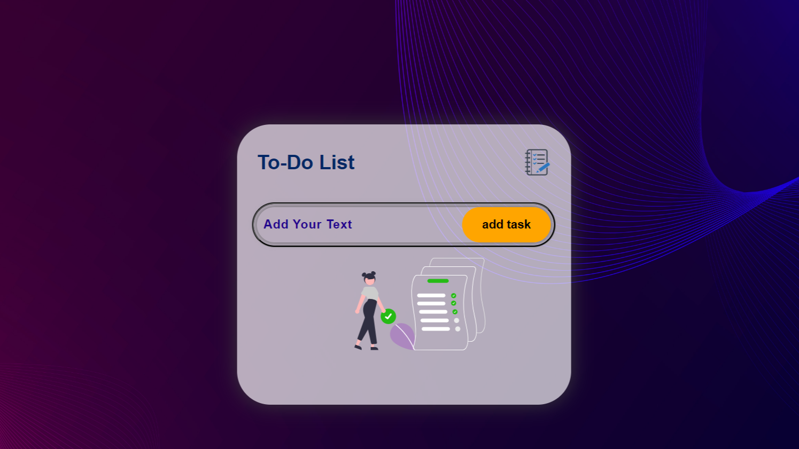
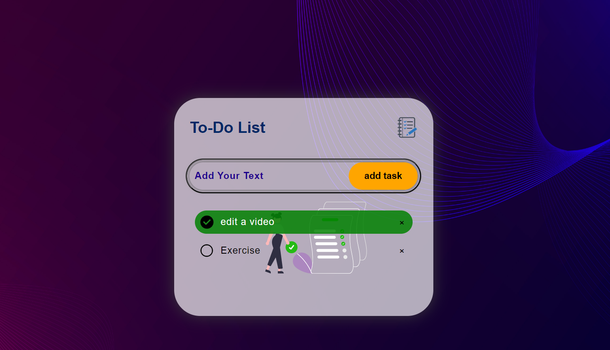

# To-Do List App



## Project Name: To-Do List

### Personal Information:
- **Name:** Shreyas
- **ID:** CT08DS2377
- **Company:** CODTECH IT SOLUTIONS
- **Domain:** Web Development
- **Duration:** June - July 2024
- **Mentor:** Neela Santosh Kumar

## Overview

This is a simple and interactive to-do list application built using HTML, CSS, and JavaScript. It allows users to add, delete, and mark tasks as completed, providing an intuitive way to manage daily tasks.

## Objective

This application aims to be a user-friendly tool that helps users:
- Improve organization and task management by creating and maintaining a list of tasks.
- Enhance productivity by breaking down goals into smaller tasks and providing a visual representation of the to-do list.
- Increase efficiency by allowing users to add, remove, and mark tasks as complete, helping them prioritize work and manage time effectively.
- Gain a sense of accomplishment by seeing completed tasks checked off the list, motivating them to keep moving forward.

## Technologies Used

- **HTML:** Defines the structure of the web page, including the input box, button, and list container.
- **CSS:** Styles the visual elements of the application, such as the background color, fonts, and layout.
- **JavaScript:** Provides interactivity, allowing users to add tasks, mark them complete, and remove them.
- **Local Storage (Optional):** Saves the task list even after the page is refreshed.

## User Interface (UI) Elements

- **Input Box:** Users enter new tasks here.
- **Add Button:** Clicking this button adds the task to the list.
- **Task List:** Displays all entered tasks.
- **Task Items:** Individual tasks displayed in the list.
- **"×" Symbol (Optional):** Clicking this symbol next to a task removes it from the list. (Implemented with a span element containing the unicode character '×')
- **Checked Status:** Clicking on a task marks it as completed.

## Functionality

- **Adding Tasks:** Users enter a task description in the input box and click the "Add" button.
- **Displaying Tasks:** Entered tasks are displayed in the list container.
- **Marking Tasks Complete:** Clicking on a task toggles its "checked" class.
- **Removing Tasks (Optional):** Clicking the "×" symbol next to a task removes it from the list.
- **Saving Tasks (Optional):** Local storage can be used to save the current task list, allowing it to persist even after the page is refreshed. (The provided code includes a savedata function but may not have a corresponding loaddata function to implement this functionality)

## Installation

To install and run this project locally, follow these steps:

1. Clone the repository:
    ```bash
    git clone https://github.com/your-username/to-do-list-app.git
    ```

2. Navigate to the project directory:
    ```bash
    cd to-do-list-app
    ```

3. Open the `todoApp.html` file in your browser:
    ```bash
    open todoApp.html
    ```

## Usage

1. Add tasks using the input field and the "Add" button.
2. Click on a task to mark it as completed.
3. Use the delete button to remove a task from the list.

## Screenshot



## Contributing

Contributions are welcome! Please feel free to submit a Pull Request.

## License

This project is licensed under the MIT License - see the [LICENSE](LICENSE) file for details.
